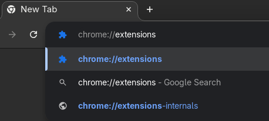
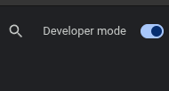
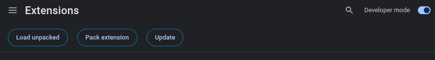
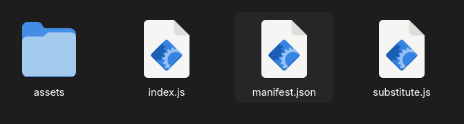

[](https://github.com/IvayloKraev/smartest-jailbreaker/blob/main/LICENSE)

# SmarTest Jailbreaker Extension

## Description
SmarTest Jailbreaker is a Chrome extension that lifts the restrictions of SmarTest’s “strict mode” 
while being lightweight and performant.

## Pre-installation

Before you install the extension, this project should be eather build or downloaded as a build.

### Building the project
1. Clone the project repository:
   ```bash
   git clone https://github.com/IvayloKraev/smartest-jailbreaker.git
   ```
2. Build it:
   ```bash
   cd smartjailbreak
   bun i
   bun run build
   ```

### Downloading the ready build

1. Go to the release page and select the wanted version. The current one is [1.0.0](https://github.com/IvayloKraev/smartest-jailbreaker/releases/tag/1.0.0).
2. Go to assets and click the smartest-jailbreaker.\[version\].zip file to download and then decompress.

## Installation

1. Open Chrome and in the URL search segment input <chrome://extensions> and press enter. <br/>
   
2. In the top right corner you should see 'Developer mode' with a toggle. 
   Make sure the mode is on (the toggle is in blue color). <br/>
   
3. After enabling the developer mode, in the top part of the page, three buttons should have appeared.
   Click the one that says 'Load unpacked'. <br/>
   
4. Now the file explorer should be in front of you. Locate where the build of the extension resides
   and inside the directory select the `manifest.json`. <br/>
   
5. Close and open the browser.
6. Enjoy your strict-mode-free tests.
